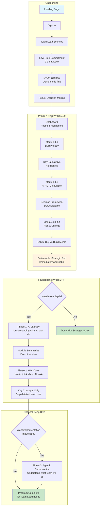
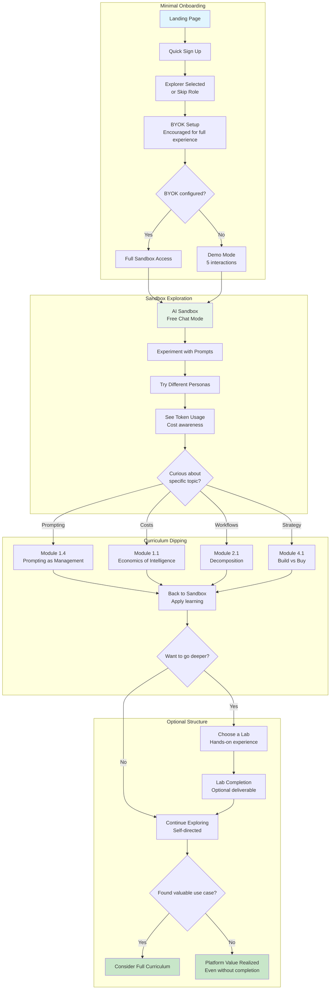
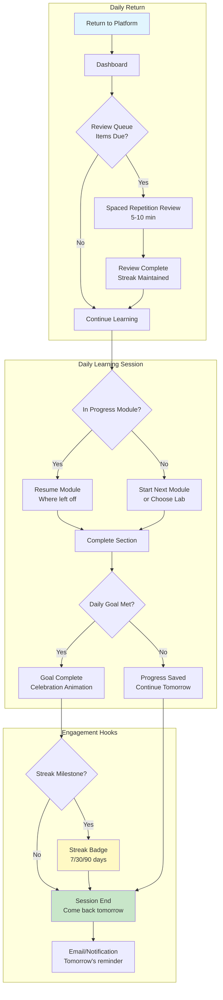
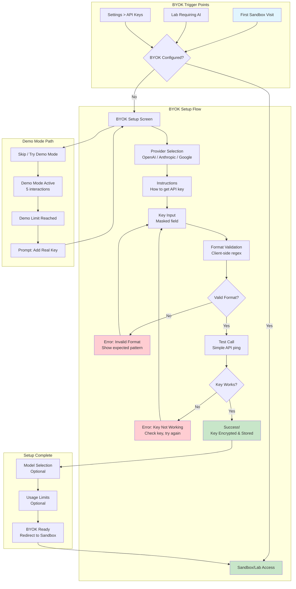
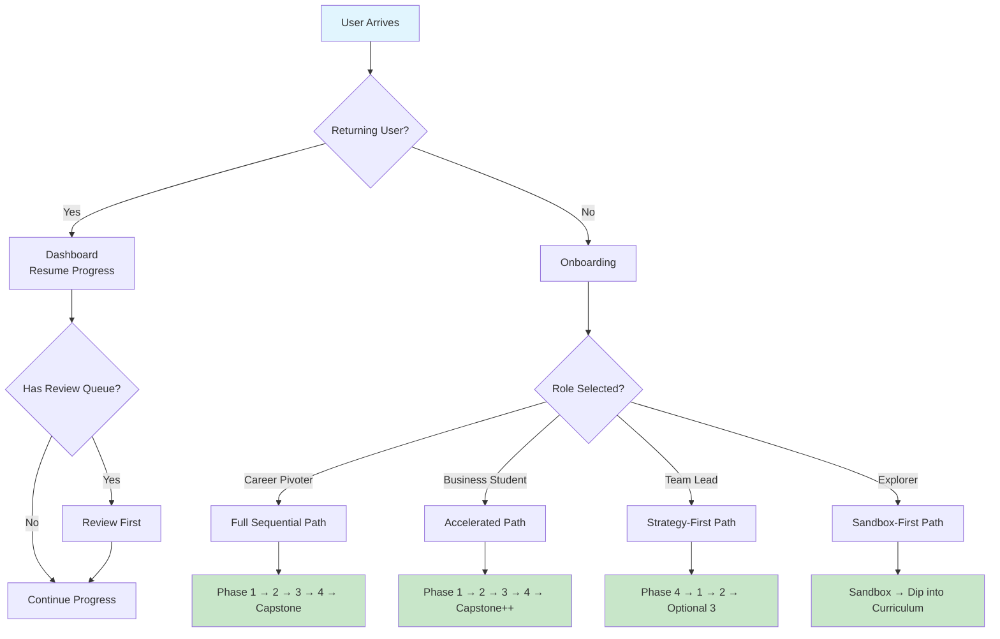

# AI Operator Academy — User Journey Maps

## Overview

This document maps the key user journeys through the AI Operator Academy platform. Each journey is represented as a Mermaid diagram with annotations for touchpoints, decision points, and success metrics.

---

## Journey 1: Career Pivoter — Full Curriculum Path

The primary journey for users seeking systematic AI skills development.

```mermaid
flowchart TD
    subgraph Onboarding["Onboarding (Day 1)"]
        A[Landing Page] --> B{Has Account?}
        B -->|No| C[Sign Up / Magic Link]
        B -->|Yes| D[Sign In]
        C --> E[Role Selection]
        D --> E
        E --> F[Career Pivoter Selected]
        F --> G[Skill Assessment<br/>Optional]
        G --> H[Daily Goal Setting<br/>30 min default]
        H --> I[BYOK Setup Prompt<br/>Skip for now available]
    end

    subgraph Phase1["Phase 1: AI Literacy (Week 1-2)"]
        I --> J[Dashboard<br/>Phase 1 Start]
        J --> K[Module 1.1<br/>Economics of Intelligence]
        K --> L[WHY Section<br/>1-2 min read]
        L --> M[WHAT Section<br/>5-8 min content]
        M --> N[HOW Section<br/>Quiz + Exercise]
        N --> O{Pass Checkpoint?}
        O -->|Yes| P[Module Complete<br/>Streak Updated]
        O -->|No| Q[Review Content<br/>Try Again]
        Q --> N
        P --> R[Module 1.2, 1.3, 1.4<br/>Same Pattern]
        R --> S[Lab 1: Persona Stress Test]
        S --> T[Lab 2: Chain of Thought Audit]
        T --> U[Phase 1 Deliverable<br/>Prompt Library]
        U --> V{Deliverable Submitted?}
        V -->|Yes| W[Phase 1 Complete<br/>Badge Earned]
        V -->|No| X[Reminder + Scaffolding]
        X --> U
    end

    subgraph Phase2["Phase 2: Workflow Engineering (Week 3-4)"]
        W --> Y[Phase 2 Unlocked]
        Y --> Z[Modules 2.1-2.4<br/>Same Learning Pattern]
        Z --> AA[Labs 3-4]
        AA --> AB[Phase 2 Deliverable<br/>Workflow Design Doc]
        AB --> AC[Phase 2 Complete]
    end

    subgraph Phase3["Phase 3: Agentic Orchestration (Week 5-6)"]
        AC --> AD[Phase 3 Unlocked]
        AD --> AE[Modules 3.1-3.5]
        AE --> AF[Lab 5: AI Assistant + Lab 5b: Multi-Agent Swarm]
        AF --> AG[Phase 3 Deliverable<br/>Multi-Agent System]
        AG --> AH[Phase 3 Complete]
    end

    subgraph Phase4["Phase 4: Strategy (Week 7-8)"]
        AH --> AI[Phase 4 Unlocked]
        AI --> AJ[Modules 4.1-4.4]
        AJ --> AK[Labs 6-7]
        AK --> AL[Phase 4 Deliverable<br/>Strategic Recommendation]
        AL --> AM[Phase 4 Complete]
    end

    subgraph Capstone["Capstone Project (Week 9-10)"]
        AM --> AN[Capstone Briefing]
        AN --> AO[Project Selection]
        AO --> AP[Current State Analysis]
        AP --> AQ[Workflow Design]
        AQ --> AR[Prototype Build]
        AR --> AS[Business Case]
        AS --> AT[Final Presentation]
        AT --> AU[Capstone Complete]
    end

    subgraph Completion["Program Completion"]
        AU --> AV[Portfolio Assembly]
        AV --> AW[Export Options<br/>HTML/PDF]
        AW --> AX[Certificate Generated]
        AX --> AY[Share to LinkedIn]
        AY --> AZ[Program Complete<br/>Success!]
    end

    style A fill:#e1f5fe
    style AZ fill:#c8e6c9
    style W fill:#fff3e0
    style AC fill:#fff3e0
    style AH fill:#fff3e0
    style AM fill:#fff3e0
    style AU fill:#fff3e0
```

### Touchpoint Annotations

| Step | Touchpoint | Success Metric |
|------|------------|----------------|
| Role Selection | First-time user experience | >90% complete within 2 min |
| Module Checkpoint | Learning verification | >70% pass on first attempt |
| Lab Completion | Hands-on skill application | >80% submit within recommended time |
| Phase Deliverable | Portfolio artifact creation | >75% achieve "Good" or better |
| Capstone | End-to-end capability demonstration | >70% complete program |

---

## Journey 2: Business Student — Accelerated Path

Optimized for motivated learners who can dedicate more time.

```mermaid
flowchart TD
    subgraph Onboarding["Onboarding"]
        A[Landing Page] --> B[Sign Up]
        B --> C[Business Student Selected]
        C --> D[Aggressive Goal Setting<br/>1 hr/day]
        D --> E[BYOK Setup<br/>Encouraged]
        E --> F[Achievement Preview<br/>Show badges available]
    end

    subgraph AcceleratedLearning["Accelerated Learning (6 weeks)"]
        F --> G[Dashboard with<br/>Gamification Overlay]
        G --> H[Phase 1<br/>1 week compressed]
        H --> I[Achievement: First Phase!]
        I --> J[Phase 2<br/>1 week compressed]
        J --> K[Streak Achievement<br/>7-day streak]
        K --> L[Phase 3<br/>1 week compressed]
        L --> M[Achievement: Builder!]
        M --> N[Phase 4<br/>1 week compressed]
        N --> O[Achievement: Strategist!]
    end

    subgraph CapstoneEmphasis["Capstone Focus (2 weeks)"]
        O --> P[Capstone Selection<br/>Career-aligned]
        P --> Q[Extended Project Work<br/>Portfolio-worthy]
        Q --> R[Peer Review<br/>Future feature]
        R --> S[Final Polishing]
        S --> T[Portfolio Export]
    end

    subgraph CareerPrep["Career Preparation"]
        T --> U[LinkedIn Integration]
        U --> V[Interview Prep Mode<br/>Practice explanations]
        V --> W[Ready for Job Market!]
    end

    style A fill:#e1f5fe
    style W fill:#c8e6c9
    style I fill:#fff9c4
    style K fill:#fff9c4
    style M fill:#fff9c4
    style O fill:#fff9c4
```

### Key Differences from Career Pivoter

| Aspect | Career Pivoter | Business Student |
|--------|---------------|------------------|
| Pace | 4-6 hrs/week, 10 weeks | 8+ hrs/week, 8 weeks |
| Gamification | Moderate (streaks) | Heavy (achievements, badges) |
| Capstone Time | 2 weeks | 2 weeks (emphasized) |
| Focus | Skill building | Portfolio building |
| Motivation | Career security | Job market differentiation |

---

## Journey 3: Team Lead — Strategy-First Path

Optimized for busy managers who need decision-making frameworks.

### Key Differences from Full Curriculum

| Aspect | Full Curriculum | Team Lead Path |
|--------|-----------------|----------------|
| Starting Point | Phase 1 | Phase 4 |
| Completion | All phases required | Phase 4 + selective |
| Content View | Full WHY-WHAT-HOW | Key Takeaways emphasized |
| Labs | All labs | Strategic labs only |
| Time to Value | 10 weeks | 2 weeks |

---

## Journey 4: Curious Explorer — Sandbox-First Path

Optimized for self-directed learners who prefer experimentation.

### Key Differences from Structured Paths

| Aspect | Structured Path | Explorer Path |
|--------|-----------------|---------------|
| Starting Point | Curriculum | Sandbox |
| Navigation | Linear, guided | Non-linear, self-directed |
| Completion Goal | Full program | Value realization (subjective) |
| Content Consumption | Sequential modules | On-demand, as-needed |
| Success Metric | Completion rate | Return visits, exploration breadth |

---

## Journey 5: Returning User — Daily Engagement Loop

The micro-journey that keeps users engaged between major milestones.

### Engagement Metrics

| Metric | Target | Measurement |
|--------|--------|-------------|
| Daily Return Rate | >40% | Users returning within 24 hours |
| Review Completion | >80% | Review queue items completed when due |
| Streak Maintenance | >60% | Users maintaining 7+ day streaks |
| Daily Goal Achievement | >70% | Users meeting daily time goal |

---

## Journey 6: BYOK Setup Flow

Critical sub-journey for AI Sandbox access.

### BYOK Success Metrics

| Metric | Target | Measurement |
|--------|--------|-------------|
| Setup Completion | >70% | Users who start BYOK setup and complete |
| First Attempt Success | >80% | Keys validated on first try |
| Demo to Real Conversion | >50% | Demo mode users who add real key |
| Provider Distribution | Monitor | OpenAI vs Anthropic vs Google usage |

---

## Cross-Journey Decision Points

### Critical Decision Tree

---

## Next Steps

1. **Wireframe Key Screens**: Create low-fidelity wireframes for critical touchpoints
2. **Prototype Onboarding**: Build interactive prototype of role selection flow
3. **Validate with Users**: Test journey assumptions with target persona representatives
4. **Instrument Analytics**: Define tracking events for each journey touchpoint
